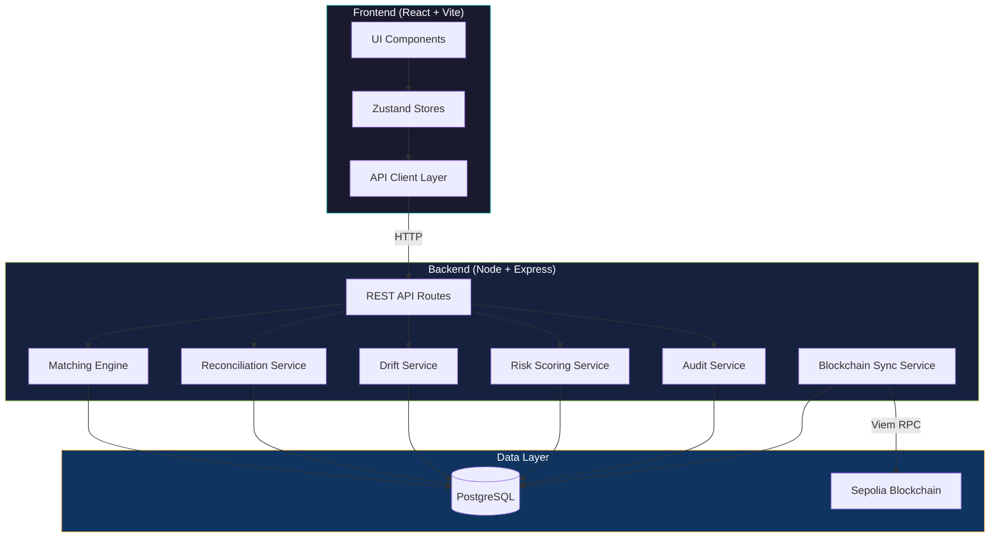
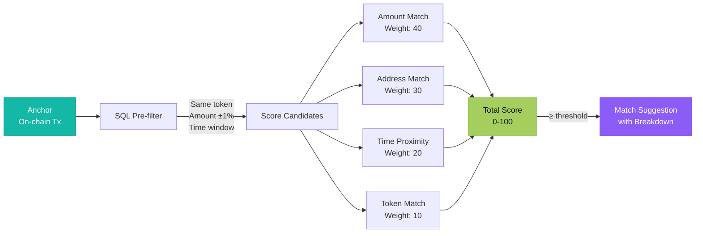
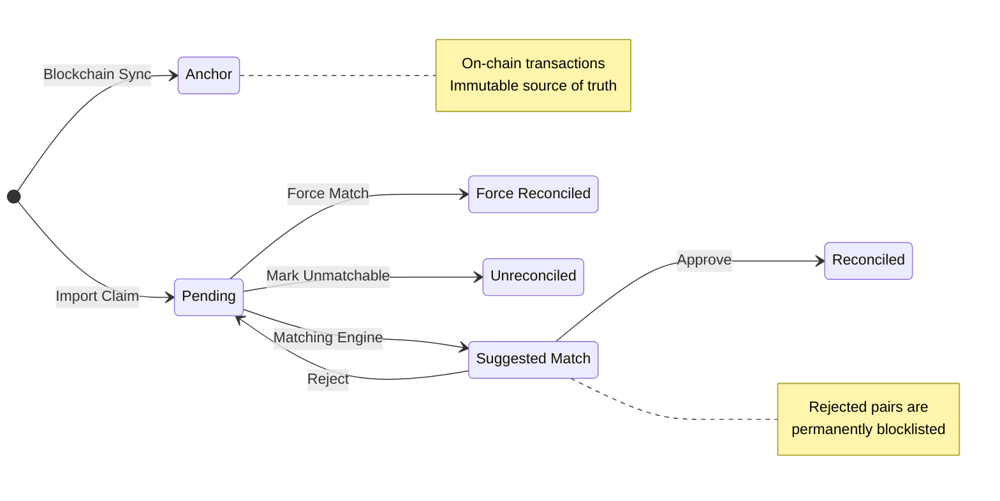
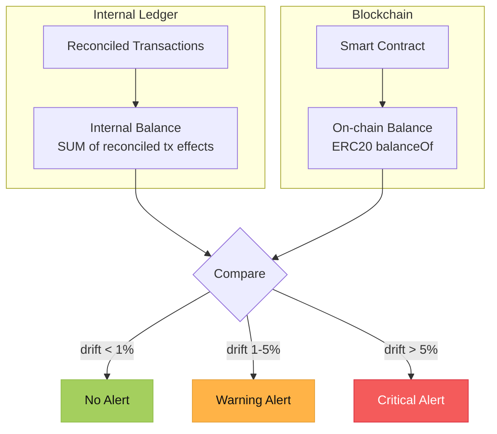
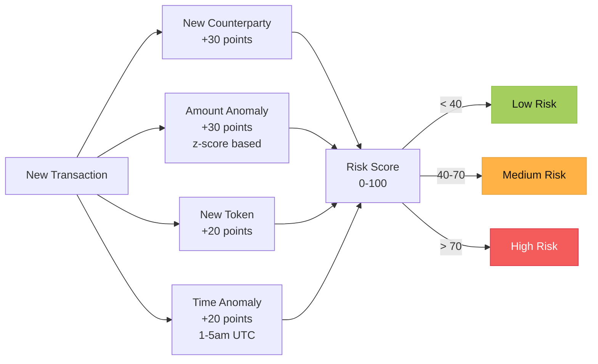
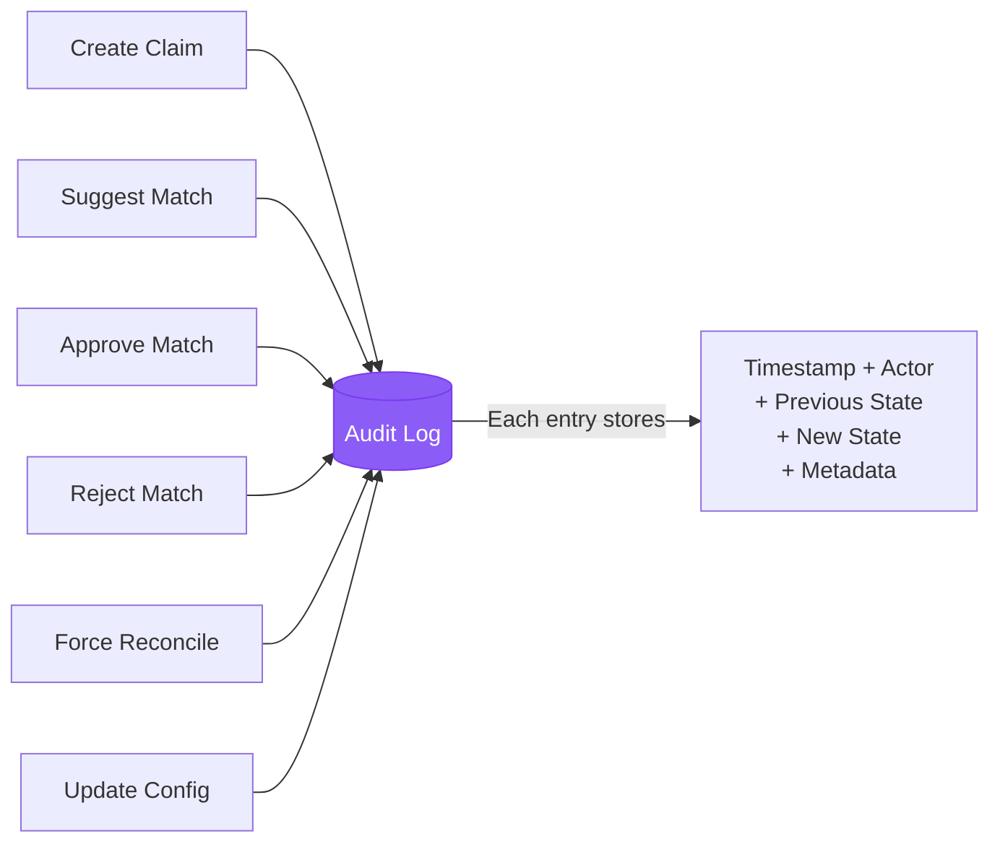
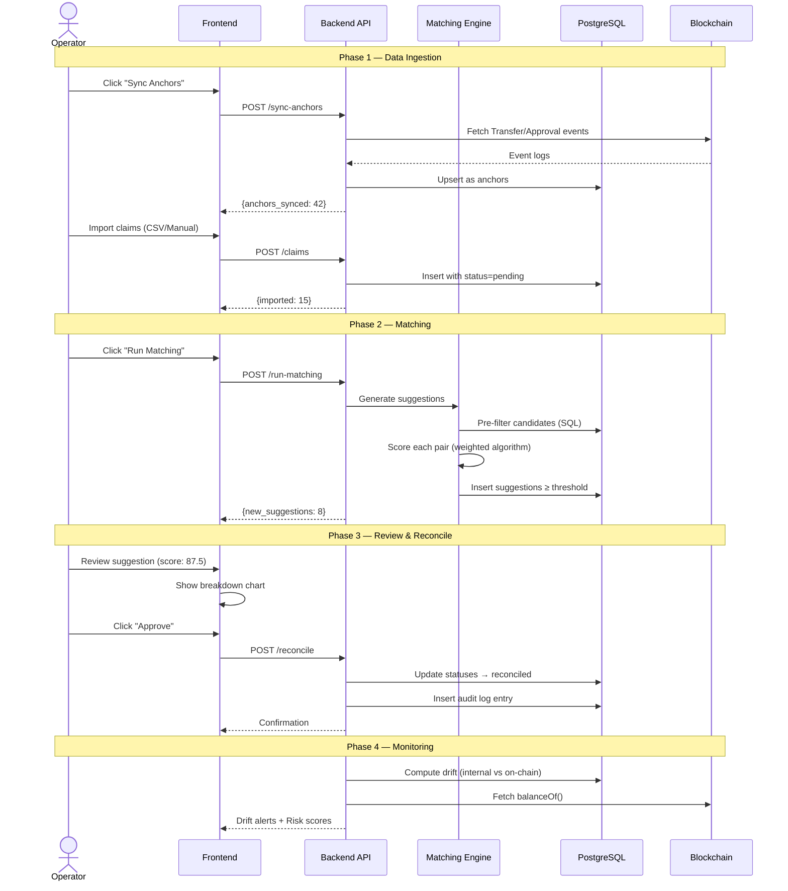
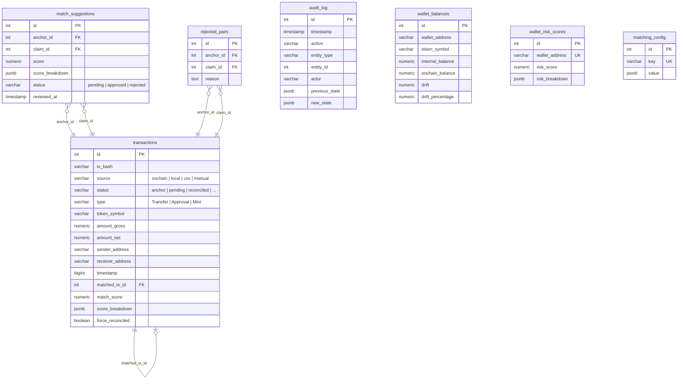

# OnChain — Blockchain Reconciliation Engine

A fintech-grade blockchain reconciliation platform that matches on-chain transactions (anchors) against off-chain records (claims) using an intelligent, explainable scoring engine. Built with React, Node/Express, and PostgreSQL.


## Live Demo

**Deployed Application**: [View Live Demo](https://on-chain-app-git-main-felipe-cremerius-projects.vercel.app/)

**GitHub Repository**: [Source Code](https://github.com/fcreme/OnChainApp)

---

## Overview

OnChain solves a core fintech problem: **how do you prove that every internal financial record has a corresponding on-chain transaction?**

The platform ingests blockchain events as immutable anchors, accepts off-chain claims (manual entry, CSV import, or app-generated), and runs a weighted matching engine that produces explainable confidence scores. Operators review suggestions, approve or reject matches, and the system maintains a complete audit trail.

---

## System Architecture



---

## Core Features

### 1. Explainable Matching Engine

The matching engine uses a weighted scoring algorithm (0-100) with four configurable factors. Every score includes a full breakdown so operators understand *why* a match was suggested.



**Scoring Details:**

| Factor | Weight | Logic |
|--------|--------|-------|
| **Amount** | 40% | Linear decay within tolerance. Gas-aware: compares both gross and net amounts |
| **Address** | 30% | 15% for sender match + 15% for receiver match |
| **Time** | 20% | Linear decay within configurable time window |
| **Token** | 10% | Exact token symbol match (binary) |

### 2. Transaction State Machine

Claims follow a strict state machine with every transition logged in the audit trail.



### 3. Drift Detection

Compares internal reconciled balances against actual on-chain balances per wallet/token pair to detect discrepancies.



### 4. Wallet Risk Scoring

Behavioral anomaly detection assigns a risk score (0-100) per wallet based on transaction patterns.



### 5. Audit Trail

Append-only log capturing every action with before/after state snapshots. Never updated, never deleted.



---

## Reconciliation Flow — End to End



---

## Tech Stack

| Layer | Technologies |
|-------|-------------|
| **Frontend** | React 18, TypeScript 5.8, Vite 7, Material-UI 7, Framer Motion, Recharts |
| **State** | Zustand, TanStack React Query |
| **Blockchain** | Wagmi v2, Viem, RainbowKit (Sepolia Testnet) |
| **Backend** | Node.js, Express 4, pg-promise |
| **Database** | PostgreSQL 16 (Docker) |
| **Validation** | Zod (shared schemas) |
| **Testing** | Vitest, React Testing Library, Cypress |

---

## Database Schema



---

## API Endpoints

### Transactions
| Method | Endpoint | Description |
|--------|----------|-------------|
| `POST` | `/api/v1/claims` | Import claims (manual or CSV array) |
| `GET` | `/api/v1/transactions` | List all transactions (paginated, filterable) |
| `GET` | `/api/v1/transactions/stats` | Aggregate stats (anchors, pending, reconciled) |
| `GET` | `/api/v1/transactions/:id` | Single transaction detail |
| `POST` | `/api/v1/sync-anchors` | Fetch on-chain events and store as anchors |

### Reconciliation
| Method | Endpoint | Description |
|--------|----------|-------------|
| `GET` | `/api/v1/suggestions` | List match suggestions (filter by score, token, status) |
| `POST` | `/api/v1/run-matching` | Trigger the matching engine |
| `POST` | `/api/v1/reconcile` | Approve a match (or force reconcile) |
| `POST` | `/api/v1/reject` | Reject a match (adds to permanent blocklist) |
| `POST` | `/api/v1/batch-reconcile` | Approve multiple matches at once |

### Drift & Risk
| Method | Endpoint | Description |
|--------|----------|-------------|
| `GET` | `/api/v1/drift` | All wallet drift summaries |
| `POST` | `/api/v1/drift/sync` | Force recompute drift for all wallets |
| `GET` | `/api/v1/risk` | All wallet risk scores |
| `POST` | `/api/v1/risk/recalculate` | Force recalculate risk scores |

### Audit & Config
| Method | Endpoint | Description |
|--------|----------|-------------|
| `GET` | `/api/v1/audit` | Paginated audit logs (filterable) |
| `GET` | `/api/v1/config/matching` | Current matching configuration |
| `PUT` | `/api/v1/config/matching` | Update weights, tolerances, thresholds |

---

## Getting Started

### Prerequisites

- **Node.js** 18+
- **Docker Desktop** ([Install](https://www.docker.com/products/docker-desktop/))
- A Web3 wallet (MetaMask recommended)
- Sepolia testnet ETH ([Faucet](https://sepoliafaucet.com/))

### Installation

```bash
# Clone the repository
git clone https://github.com/fcreme/OnChainApp.git
cd OnChainApp

# Install frontend dependencies
npm install

# Install backend dependencies
cd server && npm install && cd ..
```

### Start the Database

```bash
# Start PostgreSQL via Docker
npm run db:up

# Run migrations (creates all tables, indexes, triggers)
npm run db:migrate
```

### Run the Application

```bash
# Start both frontend and backend
npm run dev:all

# Or run separately:
npm run dev          # Frontend → http://localhost:5173
npm run dev:server   # Backend  → http://localhost:3001
```

### Verify Setup

```bash
# Health check
curl http://localhost:3001/api/v1/health
# → { "status": "ok", "database": "connected" }
```

---

## Project Structure

```
onchainapp/
├── src/                                 # Frontend (React + Vite)
│   ├── api/                             # API client layer
│   │   ├── client.ts                    # Fetch-based HTTP client
│   │   ├── transactions.ts              # Transaction endpoints
│   │   ├── reconciliation.ts            # Matching & suggestions
│   │   ├── audit.ts                     # Audit log queries
│   │   └── drift.ts                     # Drift & risk endpoints
│   ├── stores/                          # Zustand state management
│   │   ├── useReconciliationStore.ts    # Suggestions, matching, approve/reject
│   │   ├── useAuditStore.ts             # Audit log with filters
│   │   ├── useDriftStore.ts             # Drift & risk scores
│   │   └── useMatchConfigStore.ts       # Matching configuration
│   ├── pages/
│   │   ├── Dashboard.tsx                # Overview + drift alerts + risk widget
│   │   ├── Reconciliation.tsx           # Matching engine UI
│   │   ├── Audit.tsx                    # Audit trail viewer
│   │   ├── Settings.tsx                 # Matching config sliders
│   │   ├── Transfers.tsx                # Transaction history
│   │   └── components/
│   │       ├── reconciliation/          # Matching UI components
│   │       │   ├── SuggestionsTable.tsx
│   │       │   ├── MatchDetailDrawer.tsx
│   │       │   ├── ScoreBreakdownChart.tsx
│   │       │   ├── DriftAlertCard.tsx
│   │       │   ├── ClaimsImportDialog.tsx
│   │       │   └── BatchActionBar.tsx
│   │       └── audit/
│   │           └── AuditLogTable.tsx
│   └── lib/                             # Web3 config, contracts, utils
│
├── server/                              # Backend (Node + Express)
│   └── src/
│       ├── index.ts                     # Express entry point
│       ├── config/                      # Database, env, constants
│       ├── db/migrations/               # SQL migration files
│       ├── models/                      # TypeScript types + Zod schemas
│       ├── services/
│       │   ├── MatchingEngine.ts        # Pre-filter + weighted scoring
│       │   ├── ReconciliationService.ts # State machine transitions
│       │   ├── DriftService.ts          # Balance drift detection
│       │   ├── RiskScoringService.ts    # Behavioral anomaly detection
│       │   ├── AuditService.ts          # Append-only logging
│       │   ├── TransactionService.ts    # CRUD + candidate queries
│       │   └── BlockchainSyncService.ts # On-chain event fetching
│       ├── routes/                      # Express route handlers
│       └── middleware/                  # Error handling, Zod validation
│
└── docker-compose.yml                   # PostgreSQL + pgAdmin
```

---

## Available Scripts

| Command | Description |
|---------|-------------|
| `npm run dev` | Start frontend dev server (Vite) |
| `npm run dev:server` | Start backend dev server (Express) |
| `npm run dev:all` | Start both frontend + backend |
| `npm run build` | Build frontend for production |
| `npm run db:up` | Start PostgreSQL container |
| `npm run db:down` | Stop PostgreSQL container |
| `npm run db:migrate` | Run database migrations |
| `npm test` | Run frontend unit tests |
| `npm run test:server` | Run backend tests |
| `npm run type-check` | TypeScript type checking |

---

## Contract Addresses (Sepolia Testnet)

| Token | Address | Decimals |
|-------|---------|----------|
| DAI | `0x1D70D57ccD2798323232B2dD027B3aBcA5C00091` | 18 |
| USDC | `0xC891481A0AaC630F4D89744ccD2C7D2C4215FD47` | 6 |

---

## License

MIT
